<picture>
  <source media="(prefers-color-scheme: dark)" srcset="./dark.svg">
  <source media="(prefers-color-scheme: light)" srcset="./light.svg">
  
</picture>

### About

Full-Stack Engineer, AI Engineer, and SaaS builder — currently a student building shipped, working software rather than tutorials.

### Featured Projects

| Project | Description |
|---|---|
| [`omnira`](https://github.com/saad92005/omnira) | AI desktop assistant, built as a personal monorepo project |
| [`attendtrack`](https://github.com/saad92005/attendtrack) | Attendance tracking application |
| [`arabic-dialect-mt-nlp`](https://github.com/saad92005/arabic-dialect-mt-nlp) | Arabic dialect NLP / machine translation |

### Stack

`TypeScript` `Next.js` `React` `Python` `PostgreSQL` `Tauri`

### Connect

[GitHub](https://github.com/saad92005)
