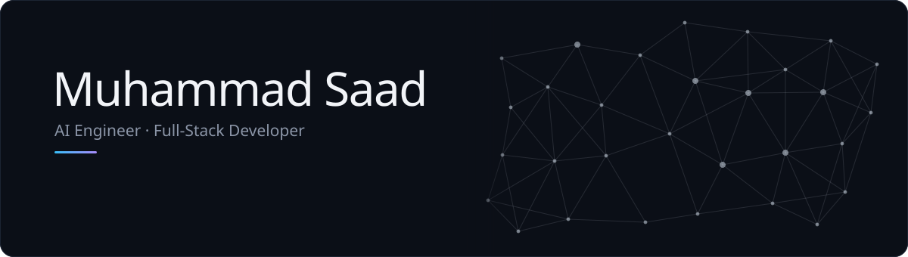
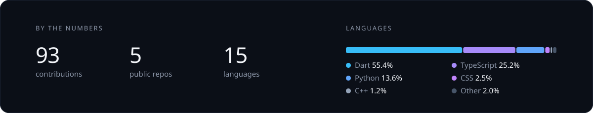
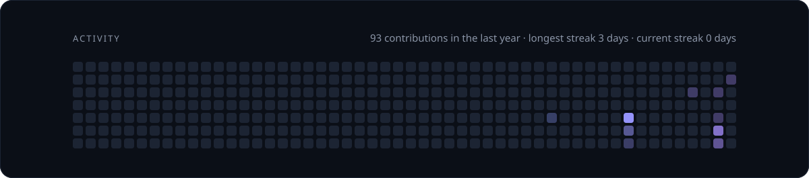

<picture>
  <source media="(prefers-color-scheme: light)" srcset="assets/header-a-light.svg">
  
</picture>

  &nbsp;
  &nbsp;
  

I'm an AI engineer and full-stack developer in Lahore, finishing a CS degree at UMT.

I build AI software that has to work for someone other than me: agents that ask permission before they act, retrieval that cites its sources, and the unglamorous parts around them, like auth, migrations, tests and CI. One of my projects was built for a real engineering services company and handles their work orders, attendance and payroll.

  <picture>
    <source media="(prefers-color-scheme: light)" srcset="https://skillicons.dev/icons?i=py,ts,dart,react,nextjs,flutter,fastapi,nodejs,postgres,prisma,firebase,pytorch,docker,githubactions,tauri,vercel&theme=light&perline=16">
    
  </picture>

<table><tr><td valign="top" width="36%">

#### Recently shipped
<!-- shipped starts -->
**[arabic-dialect-mt-nlp](https://github.com/saad92005/arabic-dialect-mt-nlp)** · [Real held-out evaluation on Tatoeba dialect data](https://github.com/saad92005/arabic-dialect-mt-nlp/commit/aac79dc0cd6a7a678442a957b114d37ae0bc5689) · Oct 5, 2026

**[saad-portfolio](https://github.com/saad92005/saad-portfolio)** · [Pin canonical site URL to saadshahid-portfolio.vercel.app](https://github.com/saad92005/saad-portfolio/commit/84253c3362c521cce78691b94867c57494724006) · Oct 5, 2026

**[aes-app](https://github.com/saad92005/aes-app)** · [AI assistant: move to Groq models that still exist](https://github.com/saad92005/aes-app/commit/8e9cf6e5a65857071391a88dc619c9ee44f7655e) · Oct 5, 2026

**[omnira](https://github.com/saad92005/omnira)** · [Fix chat on current Groq models, support plain Postgres, add…](https://github.com/saad92005/omnira/commit/b63d46f190193351311f76fcbe443bc68dd8070b) · Oct 5, 2026

**[aes-app](https://github.com/saad92005/aes-app)** · [Route AI assistant through an n8n proxy; add payroll engine…](https://github.com/saad92005/aes-app/commit/5c3971b6bf1eeae099edb581463a8e0ce37f2ab8) · Oct 5, 2026

**[omnira](https://github.com/saad92005/omnira)** · [Move product specification to docs/SPECIFICATION.md](https://github.com/saad92005/omnira/commit/cfa0cc4c4b4e0074802435ede103c8982b52d161) · Oct 5, 2026

**[saad-portfolio](https://github.com/saad92005/saad-portfolio)** · [Remove AttendTrack GitHub link (repo now private); add live…](https://github.com/saad92005/saad-portfolio/commit/b6a9e07deb128c1e1b63a95414da806735e0c167) · Oct 5, 2026
<!-- shipped ends -->

</td><td valign="top" width="40%">

#### Projects
<!-- projects starts -->
**[thinkdesk](https://github.com/saad92005/thinkdesk)** · [live](https://thinkdesk-three.vercel.app) AI-powered knowledge workspace: RAG search, document intelligence, research mode, real AI… Python · last push Oct 5, 2026

**[omnira](https://github.com/saad92005/omnira)** Permission-gated AI desktop agent: voice + chat, tool calling, capability-based permissions.… TypeScript · last push Oct 5, 2026

**[aes-app](https://github.com/saad92005/aes-app)** Field operations & business platform for an engineering services company: work orders, GPS… Dart · last push Oct 5, 2026

**[arabic-dialect-mt-nlp](https://github.com/saad92005/arabic-dialect-mt-nlp)** Dialect Arabic → English MT on a held-out Tatoeba benchmark: fine-tuned Marian reaches BLEU… Python · last push Oct 5, 2026
<!-- projects ends -->

</td><td valign="top" width="24%">

#### Now

Fine-tuning MT models for low-resource Arabic dialects

Keeping LLM API keys out of client apps

Looking for an AI engineering internship or junior role

</td></tr></table>

<picture>
  <source media="(prefers-color-scheme: light)" srcset="assets/stats-light.svg">
  
</picture>

<picture>
  <source media="(prefers-color-scheme: light)" srcset="assets/activity-light.svg">
  
</picture>

The table, numbers and activity rebuild themselves from my real GitHub data. [How this works](build_readme.py).
