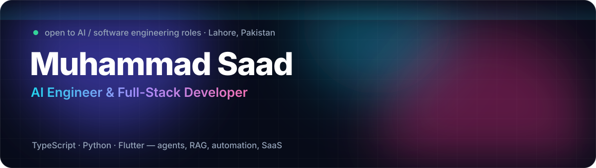
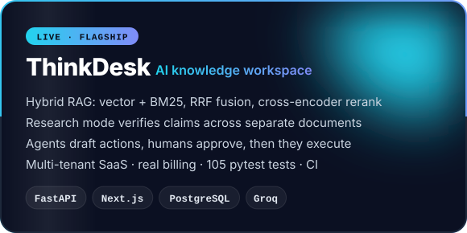
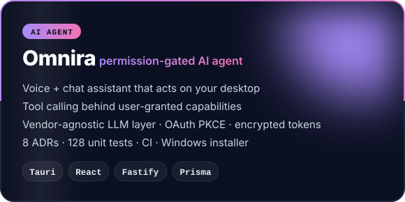
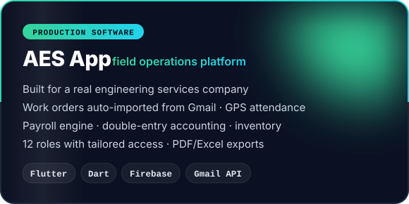
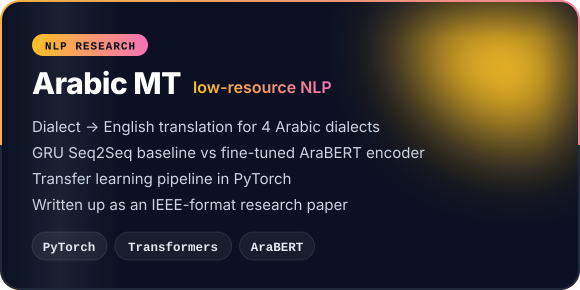

  
  
  

I build **complete, working software around AI**: agents that act only with permission, retrieval systems that cite their sources, and business platforms that real teams use every day. Most of my projects ship with tests, CI, architecture docs and a live deployment.

### ⚡ Featured work

  
  

  
  

  <a href="https://thinkdesk-three.vercel.app"><b>▶ ThinkDesk live</b></a> &nbsp;·&nbsp;
  <a href="https://omnira.netlify.app"><b>▶ Omnira web build</b></a>

### 🧠 What I work with

   
  

  <b>AI:</b> LLM apps & tool calling · hybrid RAG + reranking + evaluation · human-in-the-loop agents · transfer learning

