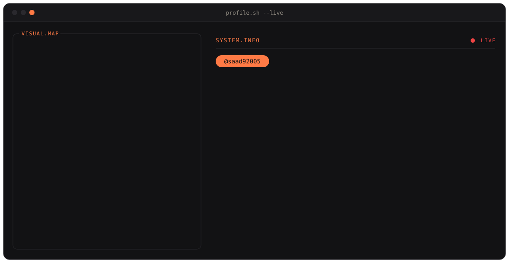
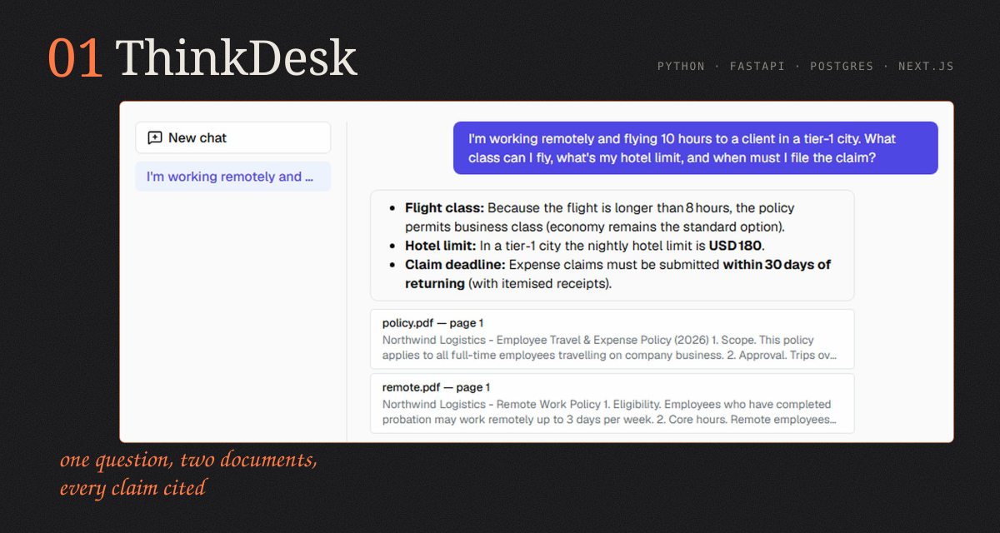
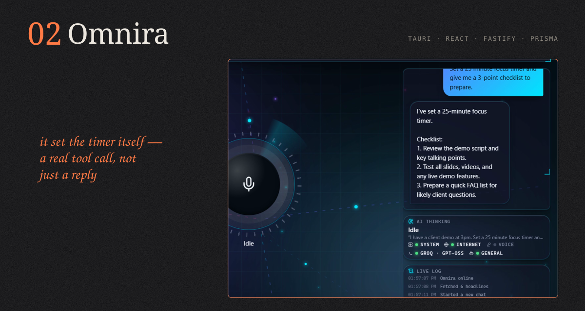
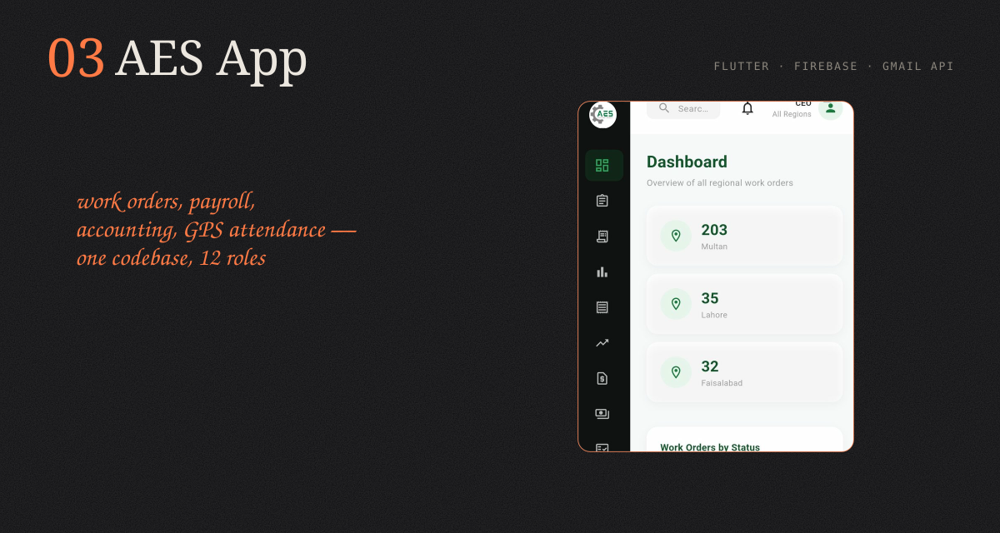
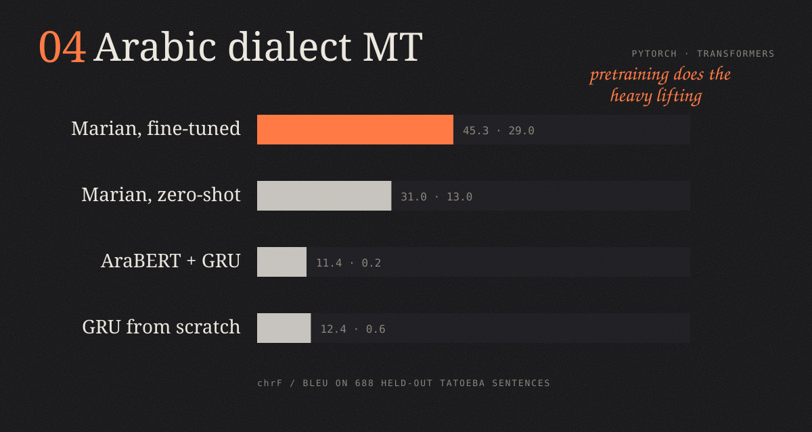

<picture>
  <source media="(prefers-color-scheme: light)" srcset="assets/banner-light.svg">
  
</picture>

  &nbsp;&nbsp;
  &nbsp;&nbsp;
  

I'm a CS student at UMT in Lahore. Most of what I build is an AI feature wrapped in a lot of ordinary, careful engineering: auth, migrations, tests, CI and the parts that make it work for someone who isn't me. I like problems where the model is the easy bit and the hard part is making it trustworthy.

<picture>
  <source media="(prefers-color-scheme: light)" srcset="assets/squiggle-light.svg">
  
</picture>

## Selected work

<a href="https://github.com/saad92005/thinkdesk">
  <picture>
    <source media="(prefers-color-scheme: light)" srcset="assets/plate-thinkdesk-light.svg">
    
  </picture>
</a>

A multi-tenant knowledge workspace. Retrieval is hybrid: vector and BM25 search fused with Reciprocal Rank Fusion, then reranked by a cross-encoder. Research mode only calls a finding *verified* when two separate documents back it up. Its agents draft Slack posts, but nothing is sent until a person approves it. 105 tests, including tenant isolation.
**[code](https://github.com/saad92005/thinkdesk) · [live](https://thinkdesk-three.vercel.app)**

 

<a href="https://github.com/saad92005/omnira">
  <picture>
    <source media="(prefers-color-scheme: light)" srcset="assets/plate-omnira-light.svg">
    
  </picture>
</a>

A desktop AI agent that can open apps, create files and set timers, but only through capabilities you've granted. It never sees a tool it isn't allowed to use. It has a provider-agnostic LLM layer, OAuth with PKCE, encrypted tokens, 8 ADRs, 131 tests and a real Windows installer.
**[code](https://github.com/saad92005/omnira)**

 

<a href="https://github.com/saad92005/aes-app">
  <picture>
    <source media="(prefers-color-scheme: light)" srcset="assets/plate-aes-light.svg">
    
  </picture>
</a>

Operations software for an engineering services company. Work orders arrive automatically from Gmail, attendance is GPS-verified, and the payroll engine has a five-stage approval flow. It also does double-entry accounting and inventory for 12 roles, all from one Flutter codebase. The AI assistant goes through a server-side proxy, so no key ships in the app.
**[code](https://github.com/saad92005/aes-app)**

 

<a href="https://github.com/saad92005/arabic-dialect-mt-nlp">
  <picture>
    <source media="(prefers-color-scheme: light)" srcset="assets/plate-arabic-light.svg">
    
  </picture>
</a>

Dialect Arabic → English translation on 688 held-out sentences across six dialects. Fine-tuning a pretrained MT model on about 1,100 dialect sentences takes BLEU from 13.0 to 29.0. The from-scratch and AraBERT + GRU baselines stay under 1 BLEU, and the write-up explains why.
**[code + write-up](https://github.com/saad92005/arabic-dialect-mt-nlp)**

<picture>
  <source media="(prefers-color-scheme: light)" srcset="assets/squiggle-light.svg">
  
</picture>

## Activity

<picture>
  <source media="(prefers-color-scheme: light)" srcset="https://streak-stats.demolab.com/?user=saad92005&amp;hide_border=true&amp;background=f7f4ee&amp;stroke=e0dbd1&amp;ring=d9541e&amp;fire=d9541e&amp;currStreakLabel=d9541e&amp;sideLabels=76716a&amp;currStreakNum=1c1b18&amp;sideNums=1c1b18&amp;dates=76716a&amp;card_width=1180">
  
</picture>

<picture>
  <source media="(prefers-color-scheme: light)" srcset="https://raw.githubusercontent.com/saad92005/saad92005/output/github-snake.svg">
  
</picture>

## What I reach for

**Every day:** TypeScript, Python, Dart. React and Next.js on the web, Flutter on mobile, Tauri for desktop. 
**Backends:** FastAPI, Fastify, PostgreSQL with Prisma or SQLAlchemy, and Firebase when the client already lives there. 
**AI:** tool-calling agents with a human in the loop, hybrid retrieval with reranking and evals, and PyTorch with Hugging Face Transformers for fine-tuning. 
**Shipping:** GitHub Actions, Docker, Vercel, Netlify and Render, plus pytest, Vitest and flutter test.

 

<picture>
  <source media="(prefers-color-scheme: light)" srcset="assets/signature-light.svg">
  
</picture>
